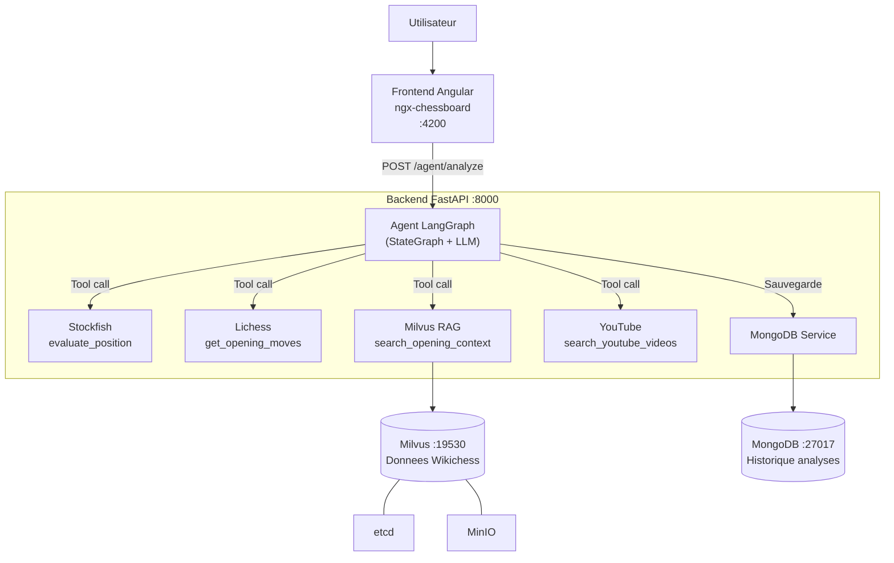

# Agent IA - Apprentissage des Ouvertures aux Echecs

POC (Proof of Concept) d'un agent IA developpe pour la **Federation Francaise des Echecs (FFE)**, en vue des championnats d'Europe jeune.

Cet agent intelligent accompagne les jeunes espoirs dans l'apprentissage des ouvertures aux echecs en proposant :

- Les **meilleurs coups** issus de la theorie des ouvertures (bibliotheque Lichess)
- Le **contexte des ouvertures** via une recherche semantique sur des donnees Wikichess (RAG)
- Des **videos explicatives** pertinentes depuis YouTube
- Une **evaluation de la position** par le moteur Stockfish lorsque la partie s'ecarte de la theorie

## Architecture



| Service | Technologie | Role |
|---------|------------|------|
| **Backend** | FastAPI + LangGraph + Python 3.12 | API REST, orchestration de l'agent IA |
| **Frontend** | Angular 21 + ngx-chessboard | Interface utilisateur avec echiquier interactif |
| **Milvus** | Milvus 2.4.4 (+ etcd + MinIO) | Base vectorielle pour la recherche semantique (RAG) |
| **MongoDB** | MongoDB 7 | Base de donnees persistante |
| **Stockfish** | Stockfish (installe dans le conteneur backend) | Moteur d'echecs pour l'evaluation des positions |

## Prerequis

- **Docker** >= 20.10 et **Docker Compose** >= 2.0
- **Git**
- Une **cle API OpenAI** (pour l'agent LangGraph - GPT-4o-mini)
- Une **cle API YouTube** (Google Cloud Console → YouTube Data API v3)
- *(Optionnel)* Un token Lichess pour augmenter les limites de requetes

## Installation et demarrage

### 1. Cloner le depot

```bash
git clone <url-du-depot>
cd AgentIA
```

### 2. Configurer les variables d'environnement

```bash
cp .env.example .env
```

Editez le fichier `.env` et renseignez vos cles API :

```env
# Cle API OpenAI (obligatoire - agent LangGraph)
OPENAI_API_KEY=votre_cle_openai_ici

# Cle API YouTube (obligatoire)
YOUTUBE_API_KEY=votre_cle_youtube_ici

# Token Lichess (optionnel, ameliore les limites de requetes)
LICHESS_TOKEN=votre_token_lichess_ici
```

Les autres variables ont des valeurs par defaut fonctionnelles et n'ont pas besoin d'etre modifiees.

### 3. Construire et lancer tous les services

```bash
docker compose up --build -d
```

Le demarrage complet prend environ 2-3 minutes. L'ordre de demarrage est gere automatiquement par les healthchecks :

```
etcd + MinIO → Milvus → data-loader (chargement Wikichess) + Backend → Frontend
                                                               MongoDB (independant)
```

### 4. Verifier que tous les services sont operationnels

```bash
# Verifier l'etat de tous les conteneurs
docker compose ps

# Tous les services doivent etre "Up" ou "Up (healthy)"
# Le data-loader doit etre "Exited (0)" (execution unique)
```

```bash
# Verifier le healthcheck du backend
curl http://localhost:8000/api/v1/healthcheck
```

### 5. Acceder a l'application

| Service | URL |
|---------|-----|
| **Frontend (interface)** | http://localhost:4200 |
| **Backend (API)** | http://localhost:8000 |
| **Documentation API (Swagger)** | http://localhost:8000/docs |

## Utilisation

1. Ouvrez http://localhost:4200 dans votre navigateur
2. L'echiquier interactif s'affiche avec la position de depart
3. Jouez un coup en deplacant une piece sur l'echiquier
4. L'**agent LangGraph** analyse la position et decide quels outils appeler :
   - **Lichess** : coups les plus joues avec statistiques
   - **Wikichess (Milvus)** : contexte et theorie de l'ouverture
   - **Stockfish** : evaluation si la position sort de la theorie
   - **YouTube** : videos explicatives si l'ouverture est identifiee
5. L'agent synthetise une **reponse en langage naturel** pour guider le joueur
6. L'analyse est **sauvegardee dans MongoDB** pour l'historique

## Positions de demonstration

Voici quelques ouvertures interessantes a jouer pour tester l'agent :

| Ouverture | Coups | FEN apres les coups |
|-----------|-------|---------------------|
| **Italienne** | 1.e4 e5 2.Cf3 Cc6 3.Fc4 | `r1bqkbnr/pppp1ppp/2n5/4p3/2B1P3/5N2/PPPP1PPP/RNBQK2R b KQkq - 3 3` |
| **Sicilienne Najdorf** | 1.e4 c5 2.Cf3 d6 3.d4 cxd4 4.Cxd4 Cf6 5.Cc3 a6 | `rnbqkb1r/1p2pppp/p2p1n2/8/3NP3/2N5/PPP2PPP/R1BQKB1R w KQkq - 0 6` |
| **Defense Francaise** | 1.e4 e6 2.d4 d5 | `rnbqkbnr/ppp2ppp/4p3/3p4/3PP3/8/PPP2PPP/RNBQKBNR w KQkq d6 0 3` |
| **Gambit Dame** | 1.d4 d5 2.c4 | `rnbqkbnr/ppp1pppp/8/3p4/2PP4/8/PP2PPPP/RNBQKBNR b KQkq c3 0 2` |
| **Caro-Kann** | 1.e4 c6 2.d4 d5 | `rnbqkbnr/pp2pppp/2p5/3p4/3PP3/8/PPP2PPP/RNBQKBNR w KQkq d6 0 3` |

## Endpoints de l'API

| Methode | Endpoint | Description | Parametres |
|---------|----------|-------------|------------|
| GET | `/api/v1/healthcheck` | Verification de l'etat du service | - |
| **POST** | **`/api/v1/agent/analyze`** | **Analyse complete par l'agent LangGraph** | **`fen` (string)** |
| GET | `/api/v1/agent/history` | Historique des analyses (MongoDB) | `limit` (int) |
| GET | `/api/v1/moves` | Coups recommandes pour une position | `fen` (string) |
| GET | `/api/v1/evaluate` | Evaluation Stockfish d'une position | `fen` (string) |
| GET | `/api/v1/vector-search` | Recherche semantique dans Wikichess | `query` (string), `top_k` (int) |
| GET | `/api/v1/videos/{opening}` | Videos YouTube pour une ouverture | `opening` (path), `max_results` (int) |

## Structure du projet

```
AgentIA/
├── backend/
│   ├── app/
│   │   ├── main.py                    # Point d'entree FastAPI + lifespan
│   │   ├── core/
│   │   │   └── config.py              # Configuration (variables d'environnement)
│   │   ├── agent/
│   │   │   ├── graph.py               # Agent LangGraph (StateGraph + orchestration)
│   │   │   └── tools.py               # Outils LangChain (Stockfish, Lichess, Milvus, YouTube)
│   │   ├── api/v1/
│   │   │   ├── router.py              # Routeur principal
│   │   │   └── endpoints/
│   │   │       ├── agent.py           # Endpoint agent IA (analyse + historique)
│   │   │       ├── moves.py           # Endpoint coups (Lichess)
│   │   │       ├── evaluate.py        # Endpoint evaluation (Stockfish)
│   │   │       ├── vector_search.py   # Endpoint recherche semantique (Milvus)
│   │   │       └── videos.py          # Endpoint videos (YouTube)
│   │   ├── services/
│   │   │   ├── lichess_service.py     # Client API Lichess
│   │   │   ├── stockfish_service.py   # Interface moteur Stockfish
│   │   │   ├── milvus_service.py      # Client base vectorielle Milvus
│   │   │   ├── youtube_service.py     # Client API YouTube
│   │   │   └── mongodb_service.py     # Client MongoDB (historique analyses)
│   │   ├── models/
│   │   │   └── chess_models.py        # Modeles Pydantic (requetes/reponses)
│   │   └── utils/
│   │       └── fen_validator.py       # Validation des positions FEN
│   ├── scripts/
│   │   └── load_wikichess_data.py     # Chargement des donnees Wikichess dans Milvus
│   ├── tests/                         # Tests unitaires (pytest)
│   └── Dockerfile
├── frontend/
│   ├── src/app/
│   │   ├── app.ts                     # Composant racine Angular
│   │   ├── components/
│   │   │   ├── chessboard/            # Composant echiquier (ngx-chessboard)
│   │   │   ├── recommendations/       # Composant recommandations de coups
│   │   │   └── video-panel/           # Composant panneau videos YouTube
│   │   └── services/
│   │       └── chess-api.service.ts   # Client HTTP vers le backend
│   ├── nginx.conf                     # Configuration Nginx (serving SPA)
│   └── Dockerfile                     # Build multi-stage (Node → Nginx)
├── docs/
│   └── etude_faisabilite_systeme_video_mcp.md  # Etude de faisabilite MCP
├── docker-compose.yml                 # Orchestration de tous les services
├── pyproject.toml                     # Dependances Python (Poetry)
├── .env.example                       # Template des variables d'environnement
└── Readme.md
```

## Services Docker

| Conteneur | Image | Port | Volume persistant |
|-----------|-------|------|-------------------|
| `chess-agent-backend` | Build local (Python 3.12 + Stockfish) | 8000 | - |
| `chess-agent-frontend` | Build local (Angular → Nginx) | 4200 | - |
| `chess-agent-data-loader` | Build local (meme image que backend) | - | - |
| `milvus-standalone` | milvusdb/milvus:v2.4.4 | 19530 | `milvus_data` |
| `milvus-etcd` | quay.io/coreos/etcd:v3.5.18 | - | `etcd_data` |
| `milvus-minio` | minio/minio | - | `minio_data` |
| `chess-agent-mongodb` | mongo:7 | 27017 | `mongodb_data` |

## Gestion des volumes persistants

Les donnees de Milvus, MongoDB, etcd et MinIO sont stockees dans des volumes Docker nommes. Elles persistent entre les redemarrages des conteneurs.

```bash
# Lister les volumes
docker volume ls

# Inspecter un volume
docker volume inspect agentia_milvus_data

# Verifier la persistence : arreter et relancer les conteneurs
docker compose down
docker compose up -d
# Les donnees Wikichess dans Milvus et les donnees MongoDB sont conservees
```

Pour repartir de zero (suppression de toutes les donnees) :

```bash
docker compose down -v
```

## Commandes utiles

```bash
# Voir les logs d'un service en temps reel
docker compose logs -f backend
docker compose logs -f frontend

# Verifier le chargement des donnees Wikichess
docker compose logs data-loader

# Relancer uniquement le backend apres modification
docker compose up --build -d backend

# Lancer les tests unitaires du backend
docker compose exec backend python -m pytest tests/ -v

# Arreter tous les services
docker compose down

# Arreter et supprimer les volumes (reset complet)
docker compose down -v
```

## Variables d'environnement

| Variable | Description | Valeur par defaut |
|----------|-------------|-------------------|
| `BACKEND_PORT` | Port du backend FastAPI | `8000` |
| `FRONTEND_PORT` | Port du frontend Angular | `4200` |
| `MONGODB_PORT` | Port de MongoDB | `27017` |
| `MONGODB_DATABASE` | Nom de la base MongoDB | `chess_agent` |
| `MILVUS_HOST` | Hote Milvus | `milvus-standalone` |
| `MILVUS_PORT` | Port Milvus | `19530` |
| `EMBEDDING_MODEL` | Modele d'embedding pour le RAG | `all-MiniLM-L6-v2` |
| `STOCKFISH_PATH` | Chemin vers le binaire Stockfish | `/usr/games/stockfish` |
| `STOCKFISH_DEPTH` | Profondeur d'analyse Stockfish | `20` |
| `YOUTUBE_API_KEY` | Cle API YouTube Data v3 | *(obligatoire)* |
| `LICHESS_TOKEN` | Token API Lichess | *(optionnel)* |
| `OPENAI_API_KEY` | Cle API OpenAI (agent LangGraph) | *(obligatoire)* |
| `OPENAI_MODEL` | Modele OpenAI utilise | `gpt-4o-mini` |
| `MONGODB_HOST` | Hote MongoDB | `chess-agent-mongodb` |

## Depannage

| Probleme | Solution |
|----------|----------|
| Milvus ne demarre pas | Verifier que les ports 19530 et 9091 sont libres. Augmenter la RAM Docker a 4 Go minimum. |
| `data-loader` en erreur | Verifier les logs : `docker compose logs data-loader`. S'assurer que Milvus est healthy avant le lancement. |
| Agent IA ne repond pas | Verifier que `OPENAI_API_KEY` est renseignee dans `.env`. Consulter les logs : `docker compose logs backend`. |
| Pas de videos YouTube | Verifier que `YOUTUBE_API_KEY` est renseignee dans `.env` et que le quota API n'est pas depasse. |
| Frontend affiche une page blanche | Verifier les logs : `docker compose logs frontend`. S'assurer que le build Angular a reussi. |
| Coups non affiches | Verifier la connectivite vers l'API Lichess : `curl https://explorer.lichess.ovh/lichess?fen=rnbqkbnr/pppppppp/8/8/4P3/8/PPPP1PPP/RNBQKBNR` |
