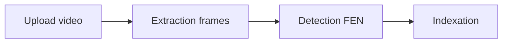
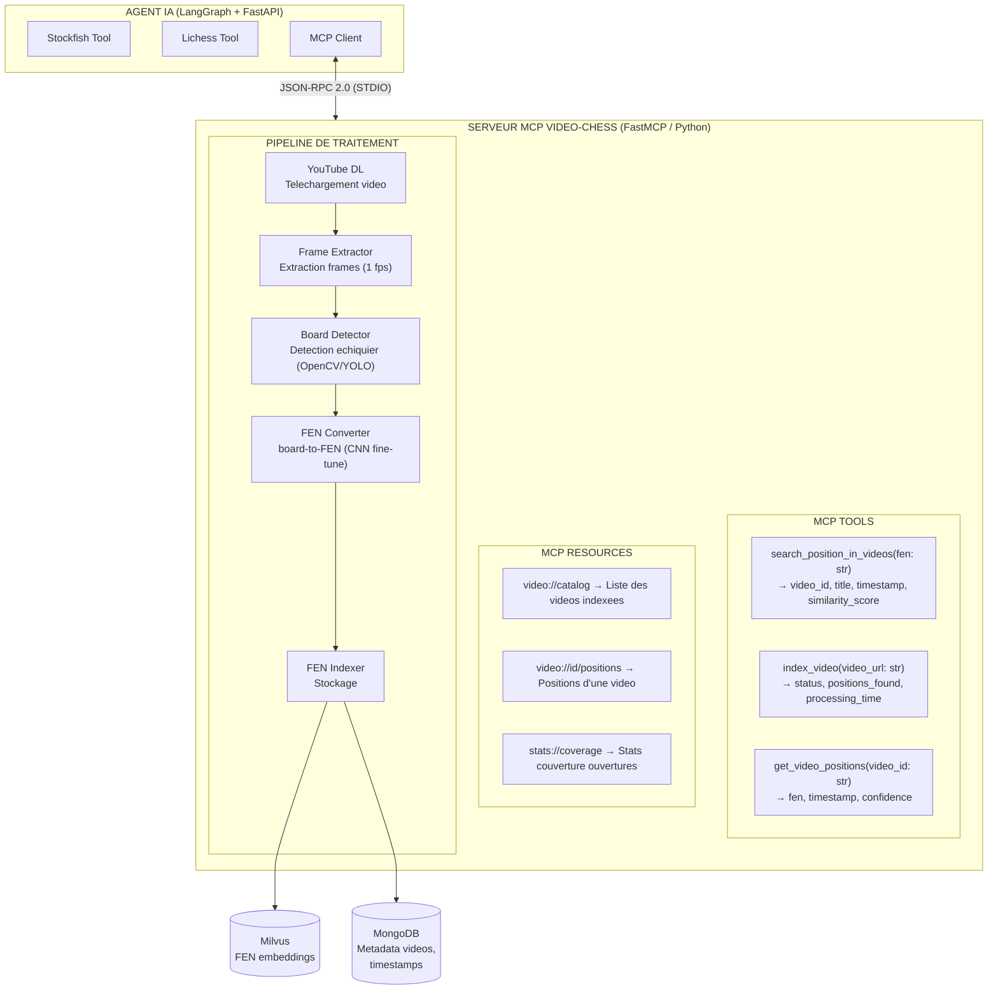
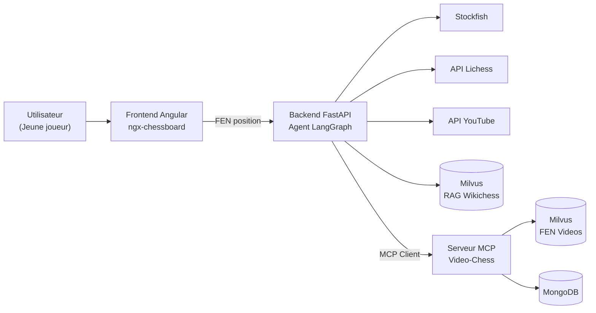
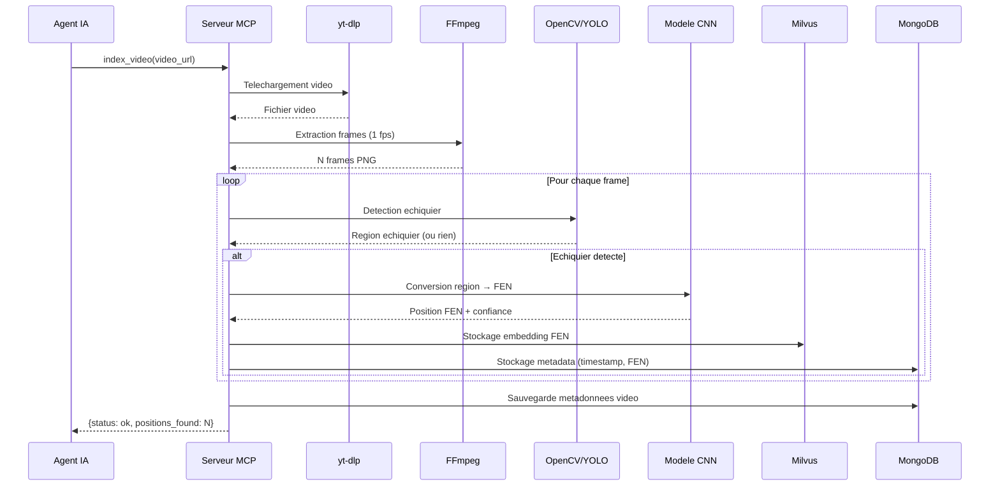
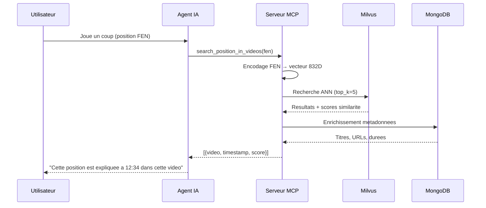
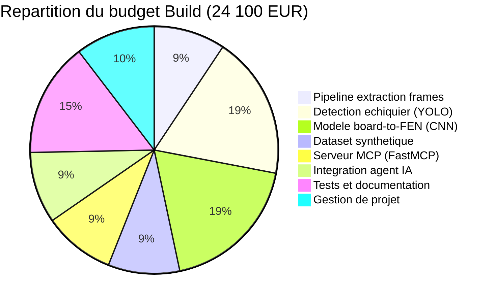
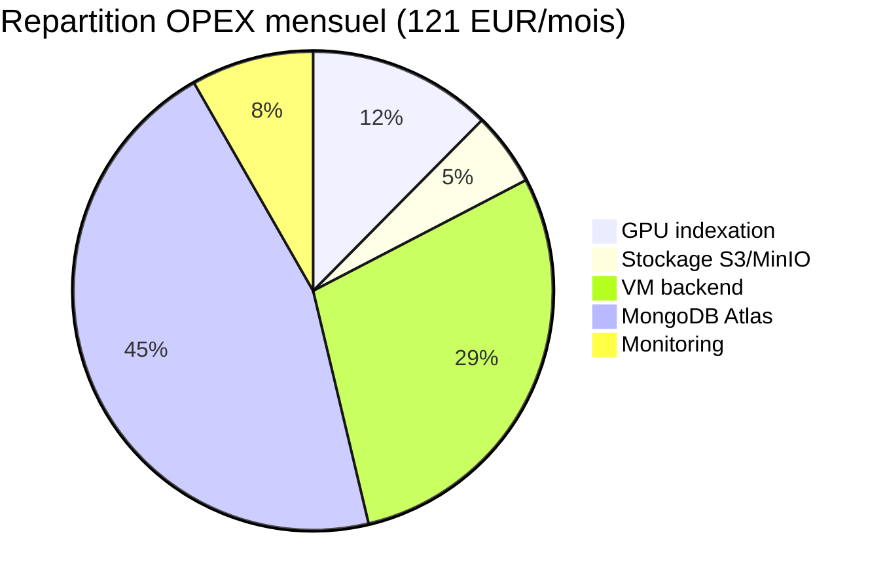
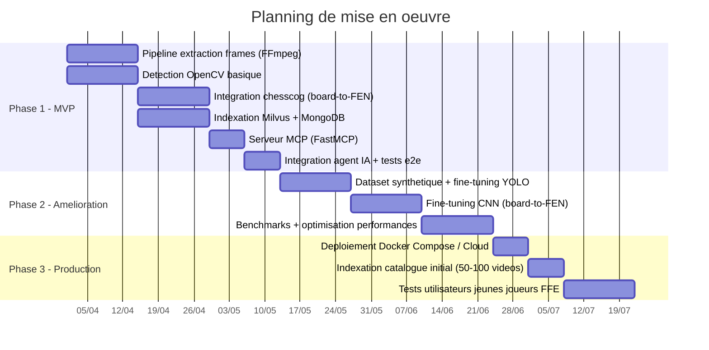

# Etude de faisabilite - Systeme avance d'analyse video pour l'apprentissage des echecs

**Projet :** Agent IA pour la Federation Francaise des Echecs (FFE)
**Date :** 19 mars 2026
**Auteur :** IA Engineer Junior - Equipe POC
**Destinataire :** Alan, Responsable Technique
**Version :** 1.0

---

## Table des matieres

1. [Introduction et contexte](#1-introduction-et-contexte)
2. [Benefices attendus du systeme](#2-benefices-attendus-du-systeme)
3. [Limites et risques identifies](#3-limites-et-risques-identifies)
4. [Architecture technique MCP](#4-architecture-technique-mcp)
5. [Detail des composants](#5-detail-des-composants)
6. [Etude de faisabilite technique](#6-etude-de-faisabilite-technique)
7. [Estimation des couts](#7-estimation-des-couts)
8. [Alternatives etudiees](#8-alternatives-etudiees)
9. [Feuille de route et recommandations](#9-feuille-de-route-et-recommandations)

---

## 1. Introduction et contexte

### 1.1 Rappel du besoin

Le POC actuel de l'agent IA pour la FFE utilise l'API YouTube pour rechercher des videos explicatives a partir de mots-cles textuels (nom de l'ouverture). Cette approche presente une limitation majeure : elle renvoie des videos entieres (souvent 30 a 45 minutes) sans pouvoir cibler le moment exact ou la position jouee par l'utilisateur est abordee.

### 1.2 Solution proposee

Concevoir un systeme avance capable de :

- **Stocker** un catalogue de videos pedagogiques pertinentes sur les echecs.
- **Analyser** chaque video image par image (extraction de frames).
- **Detecter** la presence d'un echiquier sur chaque frame et convertir la position en notation FEN (Forsyth-Edwards Notation) via un modele de vision (board-to-FEN).
- **Indexer** les positions FEN avec leurs timestamps dans une base de donnees vectorielle.
- **Rechercher** une position exacte dans le catalogue et renvoyer le lien video avec le timestamp precis.

Ce systeme serait expose via un **serveur MCP** (Model Context Protocol) pour s'interfacer avec l'agent IA existant.

### 1.3 Perimetre de l'etude

Cette etude couvre la conception du systeme (sans implementation). Elle fournit une analyse des benefices, des limites, une architecture technique, et une estimation des couts de mise en place (build) et de fonctionnement (opex).

---

## 2. Benefices attendus du systeme

### 2.1 Precision contextuelle

Le benefice principal est le passage d'une **recherche textuelle approximative** a une **recherche par position exacte**. Au lieu de proposer "une video sur la Sicilienne", le systeme peut renvoyer "cette video a 12:34, ou exactement cette position est analysee".

**Impact utilisateur :** Un jeune joueur qui joue 1.e4 c5 2.Cf3 d6 3.d4 cxd4 4.Cxd4 Cf6 5.Cc3 a6 (variante Najdorf) recevra le lien vers le moment exact ou cette position est expliquee, et non une video generique de 40 minutes sur la Sicilienne.

### 2.2 Gain de temps pour l'apprenant

- Elimination du besoin de parcourir manuellement les videos.
- Acces direct au contenu pertinent via timestamp.
- Estimation : **reduction de 80% du temps de recherche** de contenu video (de ~5 min a ~10 sec).

### 2.3 Enrichissement de la base de connaissances

- Chaque video indexee enrichit automatiquement le catalogue de positions.
- Une video de 30 minutes peut generer **50 a 200 positions FEN uniques**, toutes recherchables.
- Effet reseau : plus le catalogue grandit, plus la couverture des ouvertures s'ameliore.

### 2.4 Integration transparente via MCP

- Le serveur MCP s'integre directement dans l'agent IA existant sans modifier son architecture.
- L'agent peut appeler les outils MCP (recherche de position, ajout de video) comme n'importe quel autre outil.
- Compatibilite native avec LangGraph et les frameworks d'agents IA modernes.

### 2.5 Scalabilite du contenu

- Ajout de nouvelles videos sans intervention manuelle sur l'indexation.
- Pipeline automatise :


- Support multi-sources : YouTube, Twitch VODs, videos FFE, contenus pedagogiques internes.

---

## 3. Limites et risques identifies

### 3.1 Limites techniques

#### 3.1.1 Precision de la detection board-to-FEN

La conversion d'une image d'echiquier en notation FEN est un probleme de vision par ordinateur non trivial :

- **Variabilite des representations** : echiquiers 2D, 3D, differents themes de couleurs, tailles variables.
- **Precision estimee** des modeles actuels : 85-95% pour les echiquiers 2D numeriques (screenshots de Lichess/Chess.com), mais seulement 60-80% pour les echiquiers physiques filmes.
- **Pieces ambigues** : confusion possible entre Fou et Pion dans certaines representations graphiques.
- **Orientation du plateau** : necessite de detecter si le plateau est vu du cote blanc ou noir.
- **Information manquante** : le FEN complet inclut le trait (qui joue), les droits de roque et la case en passant, qui ne sont pas deductibles d'une seule image.

#### 3.1.2 Volume de traitement video

- Une video de 30 minutes a 1 fps = 1 800 frames a analyser.
- Un catalogue de 500 videos = ~900 000 frames.
- Temps de traitement et couts GPU significatifs.

#### 3.1.3 Qualite variable des videos

- Overlays, annotations, fleches sur l'echiquier peuvent perturber la detection.
- Transitions, animations, zooms entre les positions.
- Face-cam ou autres elements recouvrant partiellement l'echiquier.

### 3.2 Risques business

| Risque | Probabilite | Impact | Mitigation |
|--------|-------------|--------|------------|
| Precision FEN insuffisante (<80%) | Moyenne | Eleve | Validation humaine sur echantillon, modele fine-tune |
| Cout GPU depasse le budget | Faible | Moyen | Traitement par lots, instances spot |
| Droits d'auteur sur les videos | Moyenne | Eleve | Partenariats FFE, contenu sous licence |
| Adoption faible par les jeunes | Faible | Moyen | Tests utilisateurs en amont |
| Obsolescence du modele de vision | Faible | Faible | Architecture modulaire, composant remplacable |

### 3.3 Limites fonctionnelles

- **Pas de detection en temps reel** : le systeme fonctionne sur des videos pre-indexees, pas en streaming live.
- **Dependance au contenu disponible** : si aucune video ne couvre une ouverture rare, le systeme ne pourra pas aider.
- **Langue** : les videos en francais couvrent moins d'ouvertures que le contenu anglophone.

---

## 4. Architecture technique MCP

### 4.1 Schema d'architecture globale



#### Schema d'architecture globale - Vue simplifiee



### 4.2 Flux de donnees detaille

#### Flux 1 : Indexation d'une video (asynchrone)



#### Flux 2 : Recherche d'une position (synchrone, <500ms)



### 4.3 Communication MCP

Le serveur MCP utilise le transport **STDIO** pour la communication locale :

```python
from fastmcp import FastMCP

mcp = FastMCP("video-chess-server")

@mcp.tool()
async def search_position_in_videos(fen: str, top_k: int = 5) -> list[dict]:
    """Recherche une position FEN dans le catalogue de videos indexees.

    Args:
        fen: Position en notation FEN a rechercher
        top_k: Nombre maximum de resultats

    Returns:
        Liste de videos avec timestamps correspondant a la position
    """
    embedding = encode_fen_to_vector(fen)
    results = await milvus_search(embedding, top_k)
    enriched = await enrich_with_metadata(results)
    return enriched

@mcp.tool()
async def index_video(video_url: str) -> dict:
    """Indexe une video en extrayant et analysant toutes les positions d'echecs.

    Args:
        video_url: URL de la video YouTube a indexer

    Returns:
        Statut du traitement avec nombre de positions trouvees
    """
    # Pipeline: download -> extract frames -> detect boards -> convert FEN -> index
    return await run_indexing_pipeline(video_url)

@mcp.resource("video://catalog")
async def get_video_catalog() -> str:
    """Retourne la liste des videos indexees dans le catalogue."""
    videos = await mongodb_get_all_videos()
    return format_catalog(videos)
```

---

## 5. Detail des composants

### 5.1 Extraction de frames (FFmpeg)

- **Outil** : FFmpeg (open source, gratuit)
- **Configuration** : extraction a 1 fps (suffisant car les positions changent rarement plus vite)
- **Optimisation** : detection de changement entre frames pour eviter les doublons (seuil de difference de pixels > 5%)
- **Format de sortie** : images PNG 640x640 pixels

### 5.2 Detection d'echiquier

Deux approches envisagees :

**Option A : OpenCV (template matching + Hough lines)**
- Detection des lignes de la grille par transformee de Hough
- Identification du plateau par ses proprietes geometriques (grille 8x8)
- Avantage : leger, rapide (~50ms/frame), pas de GPU requis
- Inconvenient : fragile face aux variations visuelles

**Option B : YOLO v8 fine-tune (recommande)**
- Modele de detection d'objets fine-tune pour detecter les echiquiers
- Dataset d'entrainement : ~2000 images annotees (echiquiers dans differents contextes video)
- Avantage : robuste, gere les occlusions partielles, les differents styles
- Inconvenient : necessite un GPU pour l'inference rapide

### 5.3 Conversion board-to-FEN (modele de vision)

**Architecture recommandee :** CNN (ResNet-50 ou EfficientNet-B3) fine-tune

- **Entree** : image de l'echiquier (region detectee), redimensionnee a 256x256
- **Sortie** : 64 valeurs categoriques (une par case : vide, pion blanc, tour noire, etc. = 13 classes)
- **Dataset** : generation synthetique a partir de positions FEN connues + augmentation de donnees
- **Precision cible** : >95% par case, >85% pour le FEN complet

**Alternatives existantes :**
- **chesscog** (GitHub) : librairie Python pour la reconnaissance d'echiquiers, precision ~90% sur echiquiers 2D
- **chess-vision** : modele base sur YOLOv5 pour la detection piece par piece
- **GPT-4 Vision / Gemini Vision** : modeles multimodaux generiques, precision variable (70-85%), cout eleve par requete

### 5.4 Encodage FEN pour la recherche vectorielle

Le FEN n'est pas du texte classique — un encodage specifique est necessaire :

- **Approche** : encodage positionnel binaire (piece-centric)
- Chaque case est encodee en un vecteur one-hot de 13 dimensions (vide + 6 pieces x 2 couleurs)
- Le plateau complet = vecteur de 64 x 13 = **832 dimensions**
- Recherche par similarite cosinus dans Milvus (index IVF_FLAT)
- Permet de trouver des positions **similaires** (pas uniquement identiques)

### 5.5 Stockage des donnees

| Donnee | Stockage | Justification |
|--------|----------|---------------|
| Embeddings FEN | Milvus | Recherche vectorielle rapide (ANN) |
| Metadata videos | MongoDB | Donnees structurees, requetes flexibles |
| Frames extraites | Stockage fichiers (MinIO) | Volumetrie importante, acces sequentiel |
| Cache resultats | Redis (optionnel) | Acceleration des recherches frequentes |

---

## 6. Etude de faisabilite technique

### 6.1 Technologies disponibles et maturite

| Composant | Technologie | Maturite | Risque |
|-----------|------------|----------|--------|
| Extraction frames | FFmpeg | Tres haute (standard industrie) | Tres faible |
| Detection echiquier | YOLOv8 fine-tune | Haute | Faible |
| Board-to-FEN | CNN fine-tune / chesscog | Moyenne | Moyen |
| Recherche vectorielle | Milvus 2.4 | Haute (deja en prod dans le POC) | Tres faible |
| Serveur MCP | FastMCP 3.0 | Haute (protocole standardise) | Faible |
| Telechargement video | yt-dlp | Haute | Faible (TOS YouTube) |
| Metadata store | MongoDB | Tres haute | Tres faible |

### 6.2 Complexite de mise en oeuvre

**Phase 1 - Pipeline de base (4-6 semaines)**
- Extraction de frames avec FFmpeg : 2 jours
- Detection d'echiquier avec OpenCV : 1 semaine
- Integration d'un modele board-to-FEN existant (chesscog) : 1 semaine
- Indexation dans Milvus + MongoDB : 1 semaine
- Serveur MCP avec FastMCP : 1 semaine
- Tests et integration : 1-2 semaines

**Phase 2 - Ameliorations (4-6 semaines)**
- Fine-tuning YOLO pour la detection : 2 semaines
- Fine-tuning CNN pour board-to-FEN : 2 semaines
- Optimisations performances : 1-2 semaines

**Total estime : 8-12 semaines** pour une version production-ready.

### 6.3 Contraintes identifiees

- **GPU necessaire** pour l'inference du modele de vision (au minimum pour l'indexation).
- **Stockage** : ~500 Mo par video de 30 min (frames extraites).
- **Droits** : le telechargement de videos YouTube doit respecter les conditions d'utilisation (partenariats ou contenu FFE propre).
- **Latence** : la recherche de position doit rester <500ms pour une bonne UX.

---

## 7. Estimation des couts

### 7.1 Couts de developpement (Build)

| Poste | Effort (jours) | Cout unitaire | Total |
|-------|----------------|---------------|-------|
| Developpement pipeline extraction frames | 5 | 450 EUR/j | 2 250 EUR |
| Detection echiquier (YOLO fine-tune) | 10 | 450 EUR/j | 4 500 EUR |
| Modele board-to-FEN (fine-tuning CNN) | 10 | 450 EUR/j | 4 500 EUR |
| Generation dataset synthetique | 5 | 450 EUR/j | 2 250 EUR |
| Serveur MCP (FastMCP) | 5 | 450 EUR/j | 2 250 EUR |
| Integration agent IA existant | 5 | 450 EUR/j | 2 250 EUR |
| Tests, validation, documentation | 8 | 450 EUR/j | 3 600 EUR |
| Gestion de projet / coordination | 5 | 500 EUR/j | 2 500 EUR |
| **Total Build** | **53 jours** | | **24 100 EUR** |

### 7.2 Couts d'infrastructure - Developpement

| Ressource | Specification | Cout mensuel |
|-----------|--------------|--------------|
| VM GPU (fine-tuning) | AWS g4dn.xlarge (T4 16GB) | ~400 EUR/mois |
| VM CPU (pipeline) | AWS t3.large (2 vCPU, 8GB) | ~70 EUR/mois |
| Stockage S3 (frames) | 500 Go | ~12 EUR/mois |
| Milvus (deja en place) | Inclus dans l'infra existante | 0 EUR |
| MongoDB Atlas (dev) | Tier gratuit M0 | 0 EUR |
| **Total infra dev** | | **~482 EUR/mois** |

Duree estimee du dev : 3 mois -> **1 446 EUR** en infrastructure de developpement.

### 7.3 Couts de fonctionnement (OPEX) - Production

#### Scenario : 500 videos indexees, 100 utilisateurs/jour

| Poste | Detail | Cout mensuel |
|-------|--------|--------------|
| **Indexation (batch)** | | |
| GPU pour inference (indexation nouvelles videos) | ~10 videos/mois, 2h GPU | ~15 EUR/mois |
| Stockage frames (S3/MinIO) | 500 videos x 500 Mo = 250 Go | ~6 EUR/mois |
| **Serving (temps reel)** | | |
| VM backend (API + MCP) | t3.medium (2 vCPU, 4GB) | ~35 EUR/mois |
| Milvus Standalone | Inclus sur la VM backend | 0 EUR (deja provisionne) |
| MongoDB Atlas (prod) | M10 shared cluster | ~55 EUR/mois |
| **Maintenance** | | |
| Monitoring (CloudWatch/Grafana) | Basique | ~10 EUR/mois |
| **Total OPEX** | | **~121 EUR/mois** |

#### Scenario elargi : 2000 videos, 500 utilisateurs/jour

| Poste | Cout mensuel |
|-------|--------------|
| GPU indexation (40 videos/mois) | ~60 EUR/mois |
| Stockage frames (1 To) | ~24 EUR/mois |
| VM backend (t3.large) | ~70 EUR/mois |
| Milvus managed (Zilliz) | ~100 EUR/mois |
| MongoDB Atlas M20 | ~150 EUR/mois |
| CDN pour videos (optionnel) | ~50 EUR/mois |
| **Total OPEX elargi** | **~454 EUR/mois** |

### 7.4 Synthese des couts

| Phase | Cout |
|-------|------|
| **Build (developpement)** | 24 100 EUR |
| **Infrastructure dev (3 mois)** | 1 446 EUR |
| **OPEX Annuel (scenario standard)** | 1 452 EUR/an |
| **OPEX Annuel (scenario elargi)** | 5 448 EUR/an |
| **Cout total Annee 1 (standard)** | **~27 000 EUR** |
| **Cout total Annee 1 (elargi)** | **~31 000 EUR** |

#### Repartition des couts Build



#### Repartition OPEX mensuel (scenario standard)



---

## 8. Alternatives etudiees

### 8.1 Alternative A : Utilisation de modeles multimodaux (GPT-4 Vision / Gemini Vision)

**Principe :** Au lieu d'un modele CNN dedie, utiliser un LLM multimodal pour analyser chaque frame et decrire la position.

| Critere | Modele dedie (CNN) | LLM multimodal |
|---------|-------------------|-----------------|
| Precision FEN | 85-95% | 70-85% |
| Cout par frame | ~0.001 EUR | ~0.01-0.03 EUR |
| Latence | ~50ms | ~2-5s |
| Cout pour 500 videos | ~900 EUR (one-time GPU) | ~9 000-27 000 EUR |
| Maintenance | Modele a heberger | API externe |
| Scalabilite | Excellente (local) | Limitee par API rate limits |

**Verdict :** Trop couteux a grande echelle. Utilisable en fallback pour les cas difficiles.

### 8.2 Alternative B : Crowdsourcing + indexation manuelle

**Principe :** Des benevoles de la FFE indexent manuellement les timestamps des positions dans les videos.

| Critere | Systeme automatise | Crowdsourcing |
|---------|-------------------|---------------|
| Precision | 85-95% | ~99% |
| Cout initial | 24 100 EUR | ~5 000 EUR (plateforme) |
| Cout par video | ~0.50 EUR | ~5-10 EUR |
| Temps par video | ~5 min (auto) | ~2-4h (humain) |
| Scalabilite | Illimitee | Limitee par les benevoles |

**Verdict :** Complementaire. Utile pour la validation du modele automatise et pour les videos complexes.

### 8.3 Alternative C : Partenariat avec les plateformes (Lichess/Chess.com)

**Principe :** Utiliser les etudes Lichess (qui contiennent deja des positions FEN avec des videos liees) au lieu de construire un pipeline d'analyse.

**Avantages :** Donnees structurees, gratuites (Lichess est open source), pas de traitement vision.
**Inconvenients :** Catalogue limite aux etudes existantes, dependance a une plateforme tierce, pas de controle sur le contenu.

**Verdict :** Source complementaire a integrer, mais ne remplace pas un systeme propre a la FFE.

---

## 9. Feuille de route et recommandations

### 9.1 Planning de mise en oeuvre propose



### 9.2 Recommandations

1. **Commencer par les echiquiers 2D numeriques** (screenshots Lichess/Chess.com) qui sont les plus faciles a detecter avec une haute precision. Les echiquiers physiques filmes seront abordes en phase 2.

2. **Utiliser chesscog comme baseline** avant d'investir dans un modele custom. Si la precision est suffisante (>85%), le fine-tuning peut etre differe.

3. **Privilegier le contenu FFE** pour eviter les problemes de droits d'auteur. La FFE peut produire ou licencier du contenu pedagogique dedie.

4. **Implementer un mecanisme de feedback** : permettre aux utilisateurs de signaler une mauvaise detection. Ces signalements alimenteront le fine-tuning du modele.

5. **Adopter MCP des maintenant** dans le POC pour les outils existants (Stockfish, Lichess) afin de standardiser l'architecture avant d'ajouter le serveur video.

6. **Prevoir un cache intelligent** : les positions d'ouverture les plus frequentes (top 500) doivent etre pre-calculees pour une reponse instantanee.

### 9.3 Criteres de succes (Go/No-Go)

| Critere | Seuil minimum | Cible |
|---------|--------------|-------|
| Precision FEN (echiquiers 2D) | > 80% | > 95% |
| Precision FEN (echiquiers 3D/physiques) | > 60% | > 80% |
| Latence recherche position | < 1s | < 500ms |
| Temps d'indexation par video (30 min) | < 15 min | < 5 min |
| Couverture ouvertures (top 50) | > 70% | > 90% |

### 9.4 Conclusion

Le systeme d'analyse video par vision et serveur MCP est **techniquement faisable** avec les technologies actuelles. Le cout de mise en place (~27 000 EUR la premiere annee) est raisonnable pour un projet porte par la FFE. Le risque principal reside dans la precision du modele board-to-FEN, qui doit etre valide en phase MVP avant d'engager les investissements de la phase 2.

La valeur ajoutee pour les jeunes joueurs est significative : passer d'une recommandation video generique a un lien timestamp precis sur la position jouee transforme fondamentalement l'experience d'apprentissage.

L'architecture MCP garantit que ce systeme s'integrera de maniere modulaire et evolutive dans l'ecosysteme de l'agent IA, sans creer de dette technique.

---

*Document redige dans le cadre du POC Agent IA Echecs - Federation Francaise des Echecs*
*Version 1.0 - Mars 2026*
